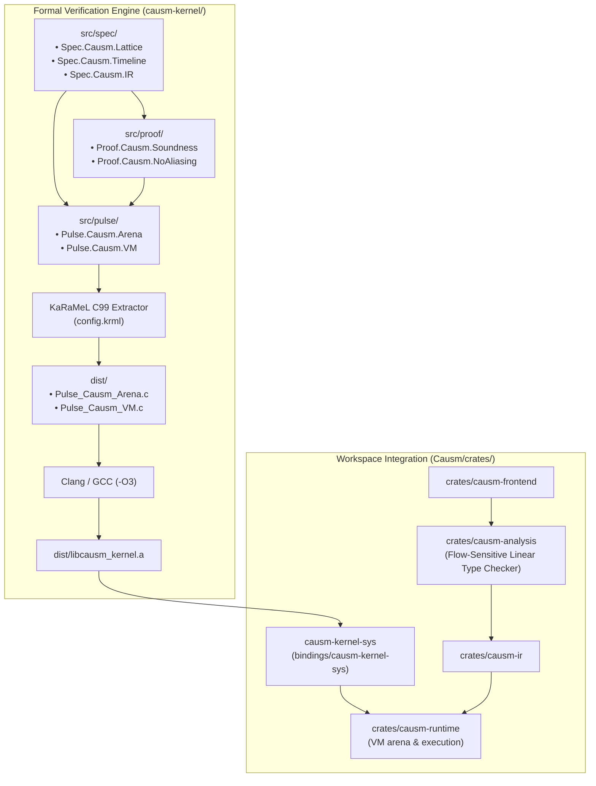

# Architecture Refactoring Proposal: Causm Kernel & Static Verifier via $\text{F}^*$ + Pulse

## Executive Summary

This proposal outlines the strategic replacement of Causm's built-in compile-time SMT/Z3 solver pipeline (`causm-smt`, `causm-entropius`, dynamic Z3 assertions in `causm-analysis`) with a mathematically verified, sound-by-construction core kernel and static verification calculus implemented in **$\text{F}^*$ and Pulse**.

Following the proven architecture of **`janus-core`**, the verified verification kernel will live **outside the Rust workspace** as a dedicated, standalone formal verification project:
- **`causm-core-fstar`** (or **`causm-kernel`**) located at root project level (`causm-kernel/` or peer `../causm-kernel`).
- Follows the complete `janus-core` layout: `src/{spec,proof,pulse}`, `dist/` (extracted C99 artifacts & `libcausm_kernel.a`), `config.krml`, and dedicated `Makefile`.
- Bridges into the Causm workspace via lightweight zero-cost FFI bindings (`bindings/causm-kernel-sys` / `crates/causm-kernel-sys`), allowing standard `cargo build` and test workflows to link against verified artifacts with zero OPAM/$\text{F}^*$ toolchain overhead for regular developers.

---

## 1. Motivation & Current Pain Points

### 1.1 The Built-in SMT Problem
Causm currently invokes an SMT backend (`causm_smt::z3` or `causm_smt::oxiz`) during every standard compiler run to evaluate:
- **Entropic Invariants 1–3**: Temporal lease boundaries, access-after-decay violations, and consume conflicts.
- **Relational Invariants**: Clock synchronization across asynchronous timeline branches.
- **WCET & Isochronous Bounds**: Formal verification of `@at` timeline deadlines and `taking` contracts.

While mathematically ambitious, hosting an SMT solver inside the compiler front-end introduces significant liabilities:
* **Quadratic/Exponential Blast:** Complex branching control flows lead to combinatorial explosion in quantifier instantiations, requiring arbitrary timeouts and unpredictable build failures.
* **Semantic Divergence:** The AST lowering in `causm-frontend`/`causm-analysis` must manually mirror the operational semantics of `causm-runtime`. Any bug in `extract_facts` or SMT translation invalidates the formal guarantee without the compiler detecting the discrepancy.
* **Host Footprint:** Embedding Z3 or maintaining custom SMT backends incurs severe build times and memory overhead on resource-constrained platforms (especially Termux/Android and WebAssembly).

### 1.2 The $\text{F}^*$ + Pulse Alternative (Lessons from `janus-core`)
In `janus-core`, cryptographic permutations, orbit periods ($|\mathcal{O}| = 2^{128}$), and causal cone cross-shielding are formally machine-checked with **zero admits** in $\text{F}^*$, while low-level stateful mutations and AAPCS64 register models are verified using Pulse and Vale before extracting clean C99 via KaRaMeL.

Applying this pattern to Causm decouples **Proof** from **Compilation**:
* **Proofs are performed once** at development time within $\text{F}^*$.
* **The compiler front-end executes a linear-time verified type-checker** that certifies inductive safety derivations.
* **The runtime microkernel executes verified Pulse state transitions** that are mathematically impossible to crash or enter undefined entropic states.

---

## 2. Standalone Verification Project Structure (Mirroring `janus-core`)

Because $\text{F}^*$, Pulse, and KaRaMeL constitute an independent formal verification pipeline with OCaml/OPAM toolchain tooling, the kernel must live outside `crates/` in its own project directory:

```
causm-kernel/                  <-- Standalone Verified Kernel (Mirrors janus-core)
├── Makefile                    <-- Discovers FSTAR_ULIB, PULSE_LIB, KRML_INCLUDE, Clang/GCC
├── config.krml                 <-- KaRaMeL extraction configuration & bundle rules
├── hints/                      <-- Replayable F* verification hints (.hints)
├── .cache/                     <-- Checked F* interface cache (.checked)
├── src/
│   ├── spec/                   <-- Pure Mathematical Specifications (F*)
│   │   ├── Spec.Causm.Lattice.fst     (Entropic lattice: Valid, Leased, Decayed, Consumed)
│   │   ├── Spec.Causm.Timeline.fst    (Discrete isochronous clocks & causal DAG)
│   │   ├── Spec.Causm.IR.fst          (Operational semantics of basic blocks & transitions)
│   │   └── Spec.Causm.Invariants.fst  (Invariants 1-3: consume, decay lease, clock barrier)
│   ├── proof/                  <-- Interactive Machine-Checked Theorems (Zero Admits)
│   │   ├── Proof.Causm.Soundness.fst  (Preservation & Progress theorems)
│   │   ├── Proof.Causm.NoAliasing.fst (Theorem: No active references after Consume)
│   │   └── Proof.Causm.ClockMonotonicity.fst
│   └── pulse/                  <-- Stateful Verified Systems Layer (Pulse Separation Logic)
│       ├── Pulse.Causm.Arena.fst      (Spatial points-to p ↦ v, fractional borrow leases)
│       ├── Pulse.Causm.Channel.fst    (Verified causal rendezvous channel queue)
│       └── Pulse.Causm.VM.fst         (Isochronous step evaluator & clock tick monitor)
├── dist/                       <-- Extracted C99 & Prebuilt Static Library
│   ├── Pulse_Causm_Arena.c
│   ├── Pulse_Causm_Arena.h
│   ├── Pulse_Causm_VM.c
│   ├── Pulse_Causm_VM.h
│   ├── krmlinit.c
│   └── libcausm_kernel.a       <-- Verified static archive linked by Rust
├── tests/                      <-- Native C Verification & Integration Tests
│   └── test_arena_decay.c
└── bindings/
    └── causm-kernel-sys/       <-- Rust FFI Crate (zero-cost link to dist/libcausm_kernel.a)
        ├── Cargo.toml
        ├── build.rs            <-- Links -lstatic=causm_kernel from ../../dist
        └── src/lib.rs          <-- Safe Rust abstractions over verified C ABI
```

---

## 3. End-to-End Pipeline & Causm Workspace Integration



---

## 4. Separation Logic in Pulse: Modeling the Causm Arena

In separation logic, access rights to memory cells are managed as linear spatial resources ($r \mapsto v$). Causm's dynamic entropic state transitions map directly to reference points-to predicates (`pts_to`), existential bindings (`exists*`), and ghost specifications:

```fstar
// src/pulse/Pulse.Causm.Arena.fst
module Pulse.Causm.Arena
#lang-pulse

open Pulse.Lib.Pervasives
open Pulse.Lib.Reference
open Pulse.Lib.Array
module U32 = FStar.UInt32
module U64 = FStar.UInt64

type u32 = FStar.UInt32.t
type u64 = FStar.UInt64.t

type entropic_state (a: Type0) =
  | St_Valid    : v:a -> entropic_state a
  | St_Leased   : v:a -> expire_tick:u64 -> entropic_state a
  | St_Decayed  : entropic_state a
  | St_Consumed : entropic_state a

type cell_t = {
  payload: u64;
  tag: u32; // 0: Valid, 1: Leased, 2: Decayed, 3: Consumed
  expire: u64;
}

type arena_cell = ref cell_t

/// Invariant 1: Dereferencing cell payload requires Valid state
fn read_valid_cell
  (c: arena_cell)
  (#s: Ghost.erased cell_t)
  requires pts_to c s ** pure (s.tag == 0ul)
  returns  res: u64
  ensures  pts_to c s ** pure (res == s.payload)
{
  let cell = !c;
  cell.payload
}

/// Invariant 2: Consumption destroys access right, transitioning cell to St_Consumed
fn consume_cell
  (c: arena_cell)
  (#s: Ghost.erased cell_t)
  requires pts_to c s ** pure (s.tag == 0ul)
  ensures  exists* (s': cell_t). pts_to c s' ** pure (s'.tag == 3ul)
{
  let cell = !c;
  c := { payload = 0uL; tag = 3ul; expire = 0uL };
}

/// Invariant 3: Leased borrows transition to St_Decayed when clock advances
fn tick_cell_decay
  (c: arena_cell)
  (current_clk: u64)
  (#s: Ghost.erased cell_t)
  requires pts_to c s ** pure (s.tag == 1ul /\ U64.ge current_clk s.expire)
  ensures  exists* (s': cell_t). pts_to c s' ** pure (s'.tag == 2ul)
{
  let cell = !c;
  c := { payload = 0uL; tag = 2ul; expire = cell.expire };
}
```

Because separation logic in Pulse strictly tracks `pts_to c s` predicates across mutations and function applications, **double-consume** (attempting to consume when `s.tag == 3ul`) and **use-after-decay** (reading when `s.tag == 2ul`) cannot satisfy the preconditions and are rejected by the proof checker.


---

## 5. Phased Refactoring Roadmap

### Phase 1: Repository Scaffolding & Spec Definition
- [ ] Scaffold `causm-kernel/` outside `crates/` with `Makefile`, `config.krml`, and standard directories matching `janus-core`.
- [ ] Write `Spec.Causm.Lattice.fst` and `Spec.Causm.Timeline.fst`.
- [ ] Formulate Invariants 1–3 as inductive $\text{F}^*$ lemmas with zero admits.

### Phase 2: Pulse Memory Arena & Microkernel
- [ ] Implement `Pulse.Causm.Arena.fst`: verified memory arena with linear consumption and automatic decay transitions.
- [ ] Implement `Pulse.Causm.VM.fst`: constant-time clock tracking, basic block dispatch, and yield barriers.
- [ ] Configure KaRaMeL extraction in `config.krml` to emit clean, unallocated C99 into `dist/`.

### Phase 3: Rust FFI Binding (`causm-kernel-sys`)
- [ ] Create `bindings/causm-kernel-sys` with `build.rs` linking against `dist/libcausm_kernel.a`.
- [ ] Wire `causm-runtime` memory arena peek/insert/consume operations directly to verified C symbols.
- [ ] Check pre-extracted C artifacts into `dist/` so standard Cargo users do not require F* or OPAM.

### Phase 4: Frontend Linear Type Checker & SMT Deprecation
- [ ] Replace SMT queries in `causm-analysis` with a deterministic flow-sensitive linear type-checker proven sound against `Spec.Causm`.
- [ ] Remove `causm-smt` and dynamic Z3 invocations from the compilation pipeline.
- [ ] Run complete regression suite and ensure zero warnings across all crates.
