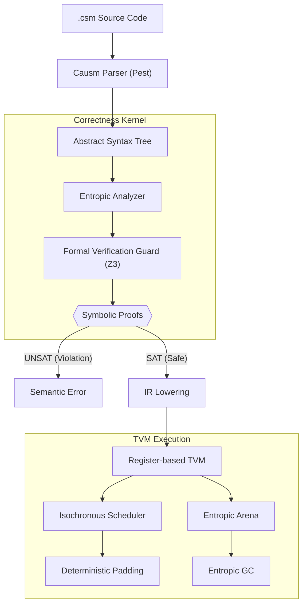

# Causm

> [!IMPORTANT]  
> **Research Status**: Causm is a domain-specific research language and experimental toolchain. It is intended for exploring temporal and entropic memory models and is **not suitable for production environments**. The specifications and implementation are subject to radical changes as the research evolves.

## Abstract

**Causm** is a domain-specific research language designed to address the inherent non-determinism in concurrent systems. By treating time as a first-class execution primitive and implementing an entropic memory model, Causm provides a framework where race conditions are eliminated through mathematical enforcement of temporal invariants. This repository contains the reference implementation of the Causm toolchain, including the compiler, analyzer, and the Z3-governed Register-based Temporal Virtual Machine (TVM).

## Core Research Questions

Causm is a prototype built to investigate and test the feasibility of the following hypotheses:

1.  **Can race conditions be mitigated by making time a verifiable execution primitive?**  
    Causm explores "Isochronous Scheduling," where execution cost is modeled deterministically. By using an SMT solver (Z3), the project investigates if it is possible to prevent unexpected interleaving by enforcing rigid temporal alignment.
2.  **Is it feasible to model memory safety through state decay rather than borrow checking?**  
    The "Entropic Memory Model" hypothesizes that treating data access as a destructive operation (state decay) can provide a simpler alternative to traditional ownership models. Causm tests if this can be verified symbolically to achieve safety without GC pauses.
3.  **Can cross-timeline state be synchronized without traditional locking mechanisms?**  
    Through "Causal Synchronization" and "Acausal Rewind," the project researches how independent execution branches might communicate state transitions while attempting to maintain a consistent causal order.
4.  **How effectively can SMT-based kernels verify temporal correctness in non-linear code?**  
    The "Z3-Governed Correctness Kernel" is an experimental implementation that unrolls loops and branches into symbolic constraints to explore the boundaries of proving Worst-Case Execution Time (WCET) bounds.

## Architecture

Causm employs a rigorous multi-pass pipeline to ensure that no program is executed unless its temporal and entropic safety is mathematically proven.



## Investigative Pillars

1.  **Time as a Primitive**: Instructions are modeled with deterministic costs, exploring if the TVM can maintain time-invariance through padding.
2.  **State Decay (Entropy)**: A model where data access triggers "decay," investigating if this can provide memory safety without a borrow checker.
3.  **Timeline Bifurcation**: Concurrency via independent branches (`split`), researching isolated memory arenas and clocks.

## Experimental Verification (Z3)

The prototype uses Z3 to test the feasibility of proving:
- **Temporal Bounds**: Modeling WCET and isochronous budgets across paths.
- **Inductive Safety**: Testing if entropic states can be preserved across loop iterations.
- **Paradox Prevention**: Tracking "Causal Horizons" to prevent inconsistent rewinds.
- **Entanglement**: Propagating decay across logically coupled variables.

## Research Patterns

### 1. Entropic Transfer
Investigating if coupling message passing with entropic consumption can prevent mid-timeline races.

```ictl
isolate Producer {
    require Chan.Outbound(id="sensor_bus", type=int)
    
    let reading = 42
    chan_send sensor_bus(reading)
    // 'reading' is now Consumed. Any further use results in a compile-time error.
}

isolate Consumer {
    require Chan.Inbound(id="sensor_bus", type=int, latency=5ms)
    
    await_chan sensor_bus
    let data = chan_recv(sensor_bus)
    // Consumer's local_clock is automatically aligned with the sender's time.
}
```

### 2. Temporal Pacing
Testing if contracts can allow the formal kernel to prove that periodic loops remain synchronized.

```ictl
routine process_packet(p: PacedIterable<int, 2ms>) taking 10ms {
    for item in p {
        // Z3 proves that body + padding == 10ms
        compute(item)
    }
}

isolate Logic {
    enable slice(50ms)
    
    loop tick {
        let batch = fetch_data()
        call process_packet(batch)
        // TVM automatically pads the remaining time to reach exactly 50ms.
    }
}
```

### 3. Acausal Reset
Exploring how timelines can "time travel" to previous anchors without violating external commitments.

```ictl
@0ms: {
  open_chan logs(10)
  anchor start
  
  let x = compute_risky()
  
  if (x.is_invalid()) {
      // SAFE: No commitments have happened since 'start'
      rewind_to(start)
  } else {
      chan_send logs(x)
      // COMMITMENT: causal_horizon is now updated to the current time.
      
      // ERROR: Z3 proves this could violate causal consistency
      // if it attempts to undo the 'chan_send' already seen by 'logs'.
      rewind_to(start) 
  }
}
```

## Documentation Index

The `docs/` directory contains the complete technical specifications and architectural documentation for Causm. For a structured overview, see the **[Full Documentation Hub](./docs/causm_index.md)**.

### 1. Language Specifications (`docs/spec/`)
- **Core**: [Formal Syntax](./docs/spec/causm_spec_syntax.md), [Semantic Model](./docs/spec/causm_spec_semantics.md), [Type System](./docs/spec/causm_spec_types.md)
- **Correctness**: [Formal Verification Guard (Z3)](./docs/spec/causm_spec_formal_verification.md), [Routine Contracts](./docs/spec/causm_spec_routines.md)
- **Temporal Mechanics**: [Isochronous Scheduling](./docs/spec/causm_spec_isochronous_scheduling.md), [Iteration & Pacing](./docs/spec/causm_spec_iteration.md)
- **Concurrency & State**: [Entropic Channels](./docs/spec/causm_spec_channels.md), [Timeline Routing](./docs/spec/causm_spec_temporal_routing.md), [Asynchronous Promises](./docs/spec/causm_spec_promises.md)
- **Advanced Mechanics**: [Temporal Leases](./docs/spec/causm_spec_leases.md), [Speculative Branches](./docs/spec/causm_spec_speculation.md), [Topological Field Access](./docs/spec/causm_spec_topologies.md), [Control Flow](./docs/spec/causm_spec_control_flow.md)

### 2. TVM Internals (`docs/tvm/`)
- **[Acausal Debugging](./docs/tvm/causm_tvm_debugging.md)**: Time-travel diagnostics and trace logs.
- **[Memory Reclamation](./docs/tvm/causm_tvm_memory_reclamation.md)**: Entropic GC (EGC) and arena management.

### 3. Proposals & RFCs (`docs/rfc/`, `docs/proposals/`)
- **[Standard RFC Process](./docs/rfc/causm_RFC.md)**: Guidelines for language evolution.
- **[Design Proposals](./docs/proposals/)**: Historical and active proposals (EGC, Isochronous Matrix, Speculative Branches, etc.).


## Execution Interface
```bash
# Analyze and run a source file
cargo run -- examples/time_travel_showcase.csm

# Perform formal verification without execution
cargo run -- --check examples/sample.csm

# Execute with full entropic tracing
cargo run -- --run --trace-entropy examples/sample.csm
```

## License
Licensed under the GNU Affero General Public License v3.0 (AGPL-3.0). See the [LICENSE](LICENSE).

---
Copyright (c) 2026 SSL-ACTX / Causm
