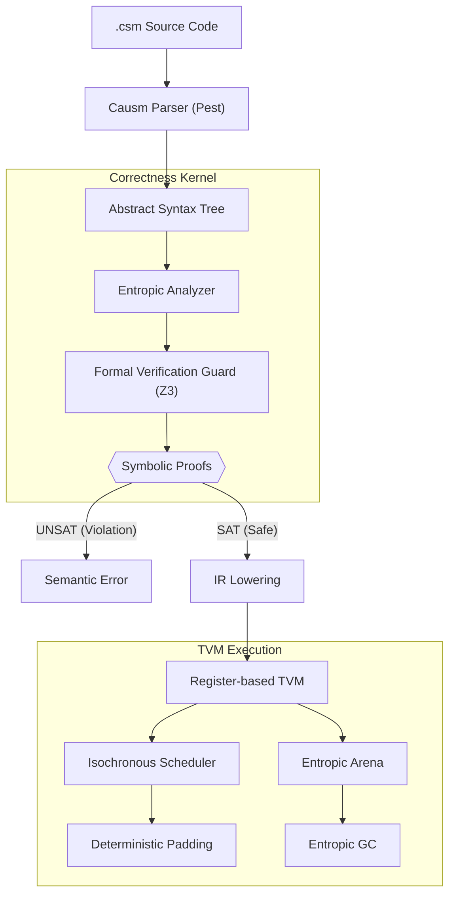

# Causm

## Abstract

**Causm** is a domain-specific research language designed to address the inherent non-determinism in concurrent systems. By treating time as a first-class execution primitive and implementing an entropic memory model, Causm provides a framework where race conditions are eliminated through mathematical enforcement of temporal invariants. This repository contains the reference implementation of the Causm toolchain, including the compiler, analyzer, and the Z3-governed Register-based Temporal Virtual Machine (TVM).

## Architecture

Causm employs a rigorous multi-pass pipeline to ensure that no program is executed unless its temporal and entropic safety is mathematically proven.



## Theoretical Framework

The design of Causm is predicated on three primary architectural pillars:

### 1. Deterministic Temporal Execution
In Causm, computational time is not an emergent side effect of hardware execution but a defined primitive within the language semantics. Every instruction is assigned a deterministic temporal cost. The TVM ensures time-invariance through deterministic padding and isochronous scheduling.

### 2. Entropic Memory Management
Causm employs an "entropic" memory model based on the principle of state decay. Accessing or moving data structures results in entropic transformation. This model eliminates the necessity for a traditional borrow checker while maintaining strict memory safety.

### 3. Isolated Timeline Concurrency
Concurrency is modeled through the explicit bifurcation of execution timelines. The `split` operation generates independent execution branches, each equipped with its own memory arena and temporal clock.

## Core Correctness Kernel (Z3 Integration)

Causm features a modular **Correctness Kernel** powered by the Z3 SMT solver. This kernel rigorously proves the following invariants before execution:

- **Symbolic Temporal Proofs**: Proves that Worst-Case Execution Time (WCET) bounds and isochronous slice budgets hold across all possible execution paths.
- **Inductive Loop Safety**: Uses bounded symbolic unrolling to prove that entropic states (like single-ownership) are preserved across arbitrary iterations.
- **Formal Paradox Prevention**: Symbolically tracks the "Causal Horizon" to ensure that `rewind_to` operations never attempt to undo events already observed by external systems.
- **Entanglement Validation**: Proves that destructive operations on logically coupled variables propagate decay correctly through the entanglement graph.

## Advanced Exemplary Patterns

### 1. High-Integrity Entropic Transfer
Causm ensures that mid-timeline communication is race-free by coupling message passing with entropic consumption and symbolic latency bounds.

```ictl
isolate Producer {
    require Chan.Outbound(id="sensor_bus", type=int)
    
    let reading = 42
    chan_send sensor_bus(reading)
    // 'reading' is now Consumed. Any further use results in a compile-time error.
}

isolate Consumer {
    require Chan.Inbound(id="sensor_bus", type=int, latency=5ms)
    
    await_chan sensor_bus
    let data = chan_recv(sensor_bus)
    // Consumer's local_clock is automatically aligned with the sender's time.
}
```

### 2. Temporal Contracts & Pacing
Embedded contracts allow the formal kernel to prove that periodic loops never drift out of sync.

```ictl
routine process_packet(p: PacedIterable<int, 2ms>) taking 10ms {
    for item in p {
        // Z3 proves that body + padding == 10ms
        compute(item)
    }
}

isolate Logic {
    enable slice(50ms)
    
    loop tick {
        let batch = fetch_data()
        call process_packet(batch)
        // TVM automatically pads the remaining time to reach exactly 50ms.
    }
}
```

### 3. Paradox-Free Acausal Reset
Causm allows timelines to "time travel" to previous anchors, but prevents paradoxes involving external commitments.

```ictl
@0ms: {
  open_chan logs(10)
  anchor start
  
  let x = compute_risky()
  
  if (x.is_invalid()) {
      // SAFE: No commitments have happened since 'start'
      rewind_to(start)
  } else {
      chan_send logs(x)
      // COMMITMENT: causal_horizon is now updated to the current time.
      
      // ERROR: Z3 proves this could violate causal consistency
      // if it attempts to undo the 'chan_send' already seen by 'logs'.
      rewind_to(start) 
  }
}
```

## Documentation Index

The `docs/` directory contains the complete technical specifications and architectural documentation for Causm. For a structured overview, see the **[Full Documentation Hub](./docs/causm_index.md)**.

### 1. Language Specifications (`docs/spec/`)
- **Core**: [Formal Syntax](./docs/spec/causm_spec_syntax.md), [Semantic Model](./docs/spec/causm_spec_semantics.md), [Type System](./docs/spec/causm_spec_types.md)
- **Correctness**: [Formal Verification Guard (Z3)](./docs/spec/causm_spec_formal_verification.md), [Routine Contracts](./docs/spec/causm_spec_routines.md)
- **Temporal Mechanics**: [Isochronous Scheduling](./docs/spec/causm_spec_isochronous_scheduling.md), [Iteration & Pacing](./docs/spec/causm_spec_iteration.md)
- **Concurrency & State**: [Entropic Channels](./docs/spec/causm_spec_channels.md), [Timeline Routing](./docs/spec/causm_spec_temporal_routing.md), [Asynchronous Promises](./docs/spec/causm_spec_promises.md)
- **Advanced Mechanics**: [Temporal Leases](./docs/spec/causm_spec_leases.md), [Speculative Branches](./docs/spec/causm_spec_speculation.md), [Topological Field Access](./docs/spec/causm_spec_topologies.md), [Control Flow](./docs/spec/causm_spec_control_flow.md)

### 2. TVM Internals (`docs/tvm/`)
- **[Acausal Debugging](./docs/tvm/causm_tvm_debugging.md)**: Time-travel diagnostics and trace logs.
- **[Memory Reclamation](./docs/tvm/causm_tvm_memory_reclamation.md)**: Entropic GC (EGC) and arena management.

### 3. Proposals & RFCs (`docs/rfc/`, `docs/proposals/`)
- **[Standard RFC Process](./docs/rfc/causm_RFC.md)**: Guidelines for language evolution.
- **[Design Proposals](./docs/proposals/)**: Historical and active proposals (EGC, Isochronous Matrix, Speculative Branches, etc.).


## Execution Interface
```bash
# Analyze and run a source file
cargo run -- examples/time_travel_showcase.csm

# Perform formal verification without execution
cargo run -- --check examples/sample.csm

# Execute with full entropic tracing
cargo run -- --run --trace-entropy examples/sample.csm
```

## License
Licensed under the GNU Affero General Public License v3.0 (AGPL-3.0). See the [LICENSE](LICENSE).

---
Copyright (c) 2026 SSL-ACTX / Causm
