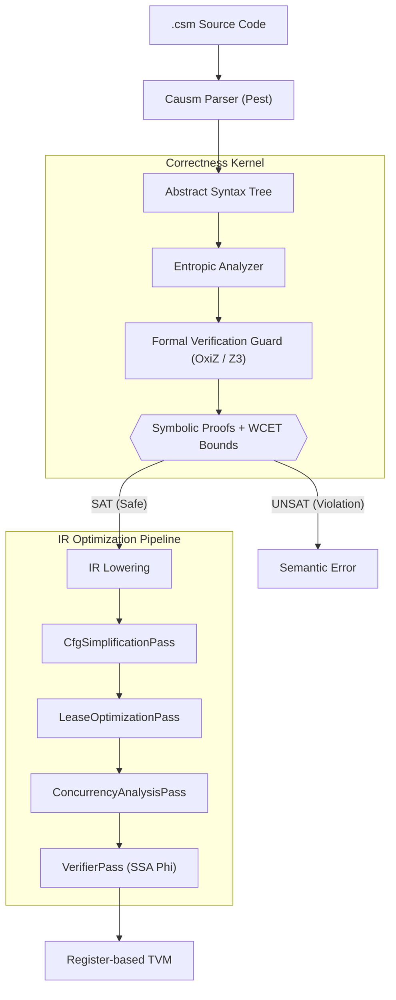

# Causm

**A Domain-Specific Language for Temporal and Entropic Memory Models**

[](https://www.gnu.org/licenses/agpl-3.0)
[](https://www.rust-lang.org/)
[]()

> [!IMPORTANT]
> Causm is an experimental toolchain for exploring temporal and entropic memory models. Specifications and implementation are subject to changes.

---

Causm is a domain-specific research language designed to address inherent non-determinism in concurrent systems. By treating time as a first-class execution primitive and implementing an entropic memory model, Causm provides a framework where race conditions are eliminated through the mathematical enforcement of temporal invariants.

This repository contains the reference implementation of the Causm toolchain, including the compiler, entropic analyzer, and formal SMT-governed Register-based Temporal Virtual Machine (TVM).

---

## Research Objectives

1. **Temporal Execution Primitives**: Eliminating race conditions via Isochronous Scheduling.
2. **Entropic Memory Model**: Modeling memory safety through state decay (`Valid`, `Leased`, `Decayed`, `Consumed`, `Pending`).
3. **Causal Synchronization**: Synchronizing cross-timeline state transitions without lock contention.
4. **SMT-Based Temporal Correctness**: Formally proving Worst-Case Execution Time (WCET) bounds using a pluggable SMT Correctness Kernel (featuring pure-Rust **OxiZ** as default and optional **Z3** integration).

---

## Architecture



---

## Code Example

```causm
@0ms: {
    isolate main_system {
        enable cpu(5000ms)
        require System.Log

        from "module_sensor_lib.csm" import compute_telemetry_digest

        let raw_reading = 150
        let ref_reading = &raw_reading

        let digest = compute_telemetry_digest(raw_reading)
        let sensor_pack = struct { status = "active", level = digest }

        lease current_pack = sensor_pack 30ms {
            let active_level = current_pack.level
            print(active_level)
        } reconcile auto

        match entropy(raw_reading) {
            Valid(v) if v == 150: { print("High Precision Match") }
            Consumed: { print("Consumed") }
        }
    }
}
```

---

## Documentation

See the [Full Documentation Hub](docs/causm_index.md) for complete specifications.

- **Specifications (`docs/spec/`)**: [Syntax](docs/spec/causm_spec_syntax.md), [Semantics](docs/spec/causm_spec_semantics.md), [Types](docs/spec/causm_spec_types.md), [Modules & Imports](docs/spec/causm_spec_modules.md), [OOP](docs/spec/causm_spec_oop.md), [Leases](docs/spec/causm_spec_leases.md), [Verification Guard](docs/spec/causm_spec_formal_verification.md)
- **TVM Internals (`docs/tvm/`)**: [TVM Optimizations](docs/tvm/causm_tvm_optimizations.md), [Acausal Debugging](docs/tvm/causm_tvm_debugging.md), [Memory Reclamation](docs/tvm/causm_tvm_memory_reclamation.md)
- **Proposals & RFCs (`docs/proposals/`)**: [Module System Proposal](docs/proposals/causm_prop_import_system.md)

---

## Getting Started & Execution

```bash
# Analyze and run a source file
causm run examples/module_import_showcase.csm

# Run with timeline merge diagnostics
causm run --explain-merge examples/module_import_showcase.csm

# Perform formal SMT verification check (OxiZ / Z3)
causm check examples/module_import_showcase.csm

# Run with explicit Z3 solver backend
causm check --z3 examples/module_import_showcase.csm

# Emit intermediate representations (AST, IR, CFG, SSA)
causm emit examples/module_import_showcase.csm --emit cfg-dot
```

---

## License

Licensed under the GNU Affero General Public License v3.0 (AGPL-3.0). See [LICENSE](LICENSE).

---

<div align="center">

Built with 🦀 & ⏳ by [Seuriin](https://github.com/SSL-ACTX)

</div>
