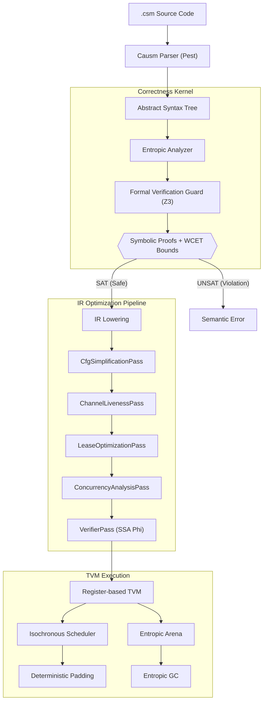

# Causm

**A Domain-Specific Language for Temporal and Entropic Memory Models**

[](https://www.gnu.org/licenses/agpl-3.0)
[](https://www.rust-lang.org/)
[]()

> [!IMPORTANT]
> Causm is an experimental toolchain for exploring temporal and entropic memory models. It is not intended for production environments. Specifications and implementation are subject to radical changes.

---

Causm is a domain-specific research language designed to address the inherent non-determinism in concurrent systems. By treating time as a first-class execution primitive and implementing an entropic memory model, Causm provides a framework where race conditions are eliminated through the mathematical enforcement of temporal invariants.

This repository contains the reference implementation of the Causm toolchain, including the compiler, analyzer, and the Z3-governed Register-based Temporal Virtual Machine (TVM).

## Table of Contents
- [Research Objectives](#research-objectives)
- [Architecture](#architecture)
- [Documentation](#documentation)
- [Getting Started](#getting-started)
- [Research Patterns](#research-patterns)
- [Execution Interface](#execution-interface)
- [License](#license)

---

## Research Objectives

Causm investigates the feasibility of the following hypotheses:

1.  **Temporal Execution Primitives**: Can race conditions be mitigated by making time a verifiable execution primitive? Causm explores "Isochronous Scheduling" to prevent unexpected interleaving by enforcing rigid temporal alignment.
2.  **Entropic Memory Model**: Is it feasible to model memory safety through state decay rather than borrow checking? Causm tests if data access as a destructive operation can provide a symbolically verifiable alternative to traditional models.
3.  **Causal Synchronization**: Can cross-timeline state be synchronized without traditional locking? The project researches how independent execution branches communicate state transitions while maintaining consistent causal order.
4.  **SMT-Based Temporal Correctness**: How effectively can kernels verify correctness in non-linear code? The project uses an experimental Z3-governed kernel to unroll loops and branches into symbolic constraints.

---

## Architecture

Causm employs a multi-pass pipeline to ensure programs are only executed if their temporal and entropic safety is mathematically proven.



---

## Documentation

Technical specifications and research documentation are in the `docs/` directory. See the [Full Documentation Hub](docs/causm_index.md) for a structured overview.

### Language Specifications (`docs/spec/`)
- **Core**: [Syntax](docs/spec/causm_spec_syntax.md), [Semantic Model](docs/spec/causm_spec_semantics.md), [Type System](docs/spec/causm_spec_types.md)
- **Correctness**: [Formal Verification Guard](docs/spec/causm_spec_formal_verification.md), [Routine Contracts](docs/spec/causm_spec_routines.md)
- **Temporal Mechanics**: [Isochronous Scheduling](docs/spec/causm_spec_isochronous_scheduling.md), [Iteration & Pacing](docs/spec/causm_spec_iteration.md)
- **Concurrency & State**: [Entropic Channels](docs/spec/causm_spec_channels.md), [Timeline Routing](docs/spec/causm_spec_temporal_routing.md), [Asynchronous Promises](docs/spec/causm_spec_promises.md)
- **OOP & Generics**: [Object-Oriented Programming](docs/spec/causm_spec_oop.md), [Temporal Leases](docs/spec/causm_spec_leases.md)

### TVM Internals (`docs/tvm/`)
- [Acausal Debugging](docs/tvm/causm_tvm_debugging.md): Diagnostics and trace logs.
- [Memory Reclamation](docs/tvm/causm_tvm_memory_reclamation.md): Entropic GC (EGC) and arena management.

---

## Getting Started

### Prerequisites

*   **Rust:** Version 1.75.0 or later
*   **Z3 Solver:** Required for formal verification

### Execution Interface

The `causm` CLI uses subcommands:

```bash
# Analyze and run a source file
causm run examples/time_travel_showcase.csm

# Perform formal verification only (no execution)
causm check examples/sample.csm

# Emit IR or diagnostic output
causm emit examples/sample.csm

# Run with verbose metrics, arena tables, and WCET bounds
causm run -v examples/sample.csm

# Run with full causal history tracing
causm run --trace-causal examples/sample.csm
```

---

## Research Patterns

### Entropic Transfer
```ictl
isolate Producer {
    require Chan.Outbound(id="sensor_bus", type=int)
    
    let reading = 42
    chan_send sensor_bus(reading)
    // 'reading' is now Consumed.
}

isolate Consumer {
    require Chan.Inbound(id="sensor_bus", type=int, latency=5ms)
    
    await_chan sensor_bus
    let data = chan_recv(sensor_bus)
}
```

### Temporal Pacing
```ictl
routine process_packet(p: PacedIterable<int, 2ms>) taking 10ms {
    for item in p {
        compute(item)
    }
}
```

### Object-Oriented Programming (OOP) & Entropic Safety
```csm
type Actor = struct {
    name: string
}

type Robot = Actor + struct decay_after 100ms {
    model: string
}

routine Actor.introduce(peek self) -> int taking 10ms {
    let name = self.name
    print("Hello, I am Actor: " + name)
    yield 0
}

interface Worker {
    routine work(consume self) -> int taking 20ms
}

routine Robot.work(consume self) -> int taking 20ms {
    print("Robot " + self.name + " is working...")
    yield 0
}

let r: Robot = struct { name = "T-800", model = "Model 101" }
r.introduce() // Dynamic lookup resolves to Actor.introduce

let w: Worker = r // Structural subtyping
w.work() // Polymorphic dispatch (consumes the robot structure)
```

### Generic Structs & Monomorphized Dispatch
```csm
type Container<T: Consumable> = struct {
    value: T
}

routine Container<T>.take_inner(consume self) -> T taking 10ms {
    let inner = self.value
    yield inner
}

let c: Container<int> = struct { value = 42 }
let v: int = c.take_inner() // monomorphized to Container<int>.take_inner
```

### Type Casting & Array Broadcasting
```csm
// Explicit numeric type casting with `as`
let val: f64 = 42 as f64
let truncated: i32 = 3.14159 as i32  // yields 3

// Scalar-to-array broadcasting
let scaled: array<int> = [1, 2, 3] * 10  // yields [10, 20, 30]

// Array-to-array elementwise operations
let a: array<int> = [1, 2, 3]
let b: array<int> = [10, 20, 30]
let sum: array<int> = a + b  // yields [11, 22, 33]
```

---

## License
Licensed under the GNU Affero General Public License v3.0 (AGPL-3.0). See [LICENSE](LICENSE).

---

<div align="center">

Built with 🦀 & ⚡ by [Seuriin](https://github.com/SSL-ACTX)

</div>
