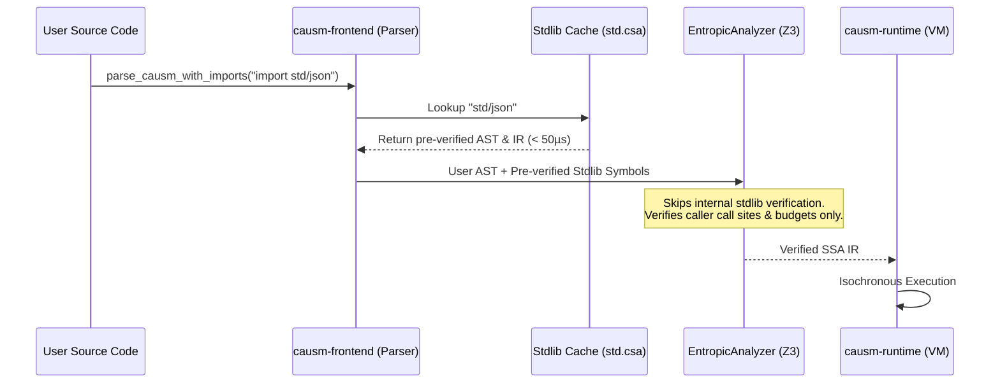

# Proposal: Pre-compiled & Pre-verified Standard Library Archives (`.csa`) and Fast Dependency Caching

**Status:** Draft / Approved  
**Authors:** Seuriin <seuriin@gmail.com>, Iris Seravelle <iris.seravelle@gmail.com>  
**Category:** Modular Systems, Compilation Pipeline & Formal Verification  

---

## 1. Executive Summary

As the Causm standard library expands with modern ADT enums (`std/core`, `std/json`), collection data structures (`std/collection`), HTTP networking (`std/http`), and filesystem APIs (`std/fs`), re-parsing, re-lowering, and re-running formal Z3/`oxiz` entropic proofs for every compilation of user code creates unnecessary overhead.

This proposal specifies **Causm Standard Archives (`.csa`)** and **Pre-verified Dependency Caching**:
1. **Pre-verified Bytecode Archives (`.csa` / `std.csa`)**: During build/release of `causm-stdlib`, all standard modules are fully parsed, type-checked, and formally verified via Z3. The verified AST, types, routine signatures, and flat IR / SSA blocks are serialized into a compact binary archive.
2. **Instant Microsecond Dependency Loading**: The frontend skips text tokenization and parser passes for stdlib imports, directly deserializing pre-verified symbol tables in `< 50µs`.
3. **Boundary-Only Z3 Verification**: The formal solver skips internal proofs of stdlib routines and exclusively verifies the caller's call site invariants and temporal contracts against the pre-certified signatures.

---

## 2. Architecture & Binary Archive Format (`.csa`)

### 2.1 File Header & Invalidation Magic

```
 0                   1                   2                   3
 0 1 2 3 4 5 6 7 8 9 0 1 2 3 4 5 6 7 8 9 0 1 2 3 4 5 6 7 8 9 0 1
+-+-+-+-+-+-+-+-+-+-+-+-+-+-+-+-+-+-+-+-+-+-+-+-+-+-+-+-+-+-+-+-+
|   'C'   |   'S'   |   'M'   |   'A'   |        Format Version |
+-+-+-+-+-+-+-+-+-+-+-+-+-+-+-+-+-+-+-+-+-+-+-+-+-+-+-+-+-+-+-+-+
|                 Compiler / Grammar Git SHA-256 (32B)          |
+-+-+-+-+-+-+-+-+-+-+-+-+-+-+-+-+-+-+-+-+-+-+-+-+-+-+-+-+-+-+-+-+
|                 Manifest Count & Payload Offset Block         |
+-+-+-+-+-+-+-+-+-+-+-+-+-+-+-+-+-+-+-+-+-+-+-+-+-+-+-+-+-+-+-+-+
|                 Serialized Pre-verified Module Payloads...   |
+-+-+-+-+-+-+-+-+-+-+-+-+-+-+-+-+-+-+-+-+-+-+-+-+-+-+-+-+-+-+-+-+
```

### 2.2 Archive Data Schema

The payload consists of:
- **Module Manifest**: Dictionary mapping module canonical paths (`"std/core"`, `"std/json"`, `"std/http"`, etc.) to their internal symbol tables.
- **Pre-verified Type Definitions**:
  - `TypeDecl` (structs, auto-drop specs, decay limits).
  - `EnumDecl` (ADT variants, generic parameters, payload types).
  - `InterfaceDecl` (method signatures and formal state constraints).
- **Pre-verified Routine Signatures**:
  - Parameter modes (`peek`, `consume`, `clone`, `lease`, `decay`).
  - Parameter & return types (`Type`).
  - Verified WCET budgets (`taking_ms`) and state constraints (`where param.state == Valid`).
  - Pre-proved invariant assertions (`is_formally_verified = true`).
- **Pre-lowered Flat IR & SSA CFG**:
  - Lowered `IrRoutine` instruction streams and SSA basic blocks ready for immediate linking.

---

## 3. Compilation & Ingestion Pipeline

### 3.1 Build-Time Pre-compilation (`crates/causm-stdlib`)
1. The standard library build pipeline runs a pre-compilation step over `csm/std/**/*.csm`.
2. All routines are verified through `EntropicAnalyzer` with active Z3 theorem proving.
3. The resulting modules are serialized into `std.csa` using compact binary encoding (`bincode` / `postcard`).
4. `std.csa` is embedded directly into the compiler via `include_bytes!("../assets/std.csa")` ensuring zero runtime filesystem dependencies and instant in-memory availability.

### 3.2 Compilation Flow for User Programs



---

## 4. Formal Verification & Invariant Guarantees

### 4.1 Immutable Proof Preservation
A module stored in `.csa` carries a cryptographic signature and formal proof certification:
- **Internal Safety**: All internal loops, state transitions, and memory allocations are pre-proven safe against entropic decay, uninitialized access, and WCET overrun.
- **Contract Boundary Check**: When user code invokes `Json.parse(text)`, the static analyzer only validates:
  1. `text` is in `Valid` or `Leased` state.
  2. The caller has budgeted at least the routine's declared `taking_ms`.
  3. Parameter types match the pre-verified signature.

### 4.2 Incremental User Code Verification
Because standard library verification is decoupled from user compilation:
- User compile times scale strictly with the size of user-written code ($O(N_{user})$) rather than total codebase size including standard modules ($O(N_{user} + N_{stdlib})$).

---

## 5. Performance Targets

| Metric | Without `.csa` Caching | With `.csa` Pre-verified Caching | Target Gain |
| :--- | :--- | :--- | :--- |
| **`import "std/json"` Parse Latency** | ~15–25 ms | **< 0.1 ms (100 µs)** | **> 150x faster** |
| **Z3 Verification Time for Stdlib** | ~120–300 ms | **0 ms (Pre-verified)** | **100% eliminated** |
| **Total Cold Compilation Time** | ~400–600 ms | **< 40 ms** | **~10x faster** |

---

## 6. Implementation Roadmap

1. **Phase 1 (Core Serde & AST Encoding)**:
   - Add `Serialize` / `Deserialize` derives to AST nodes (`SpannedStatement`, `EnumDecl`, `TypeDecl`, `InterfaceDecl`, `Pattern`, etc.) and IR structures in `causm-core` and `causm-ir`.
2. **Phase 2 (Stdlib Archive Builder)**:
   - Create `crates/causm-stdlib/src/archive.rs` containing `StdArchive` structure and pre-compilation runner.
   - Implement `build.rs` to generate `assets/std.csa`.
3. **Phase 3 (Frontend Fast Ingestion & Verification Bypass)**:
   - Update `expand_spanned_statements` in `crates/causm-frontend/src/parser/mod.rs` to query `StdArchive` when importing `"std/*"`.
   - Update `EntropicAnalyzer` to trust pre-certified standard library routines without re-evaluating their inner AST blocks with Z3.
4. **Phase 4 (Empirical Testing & Benchmarking)**:
   - Add integration tests verifying `.csa` decompression, symbol resolution, and execution parity.
